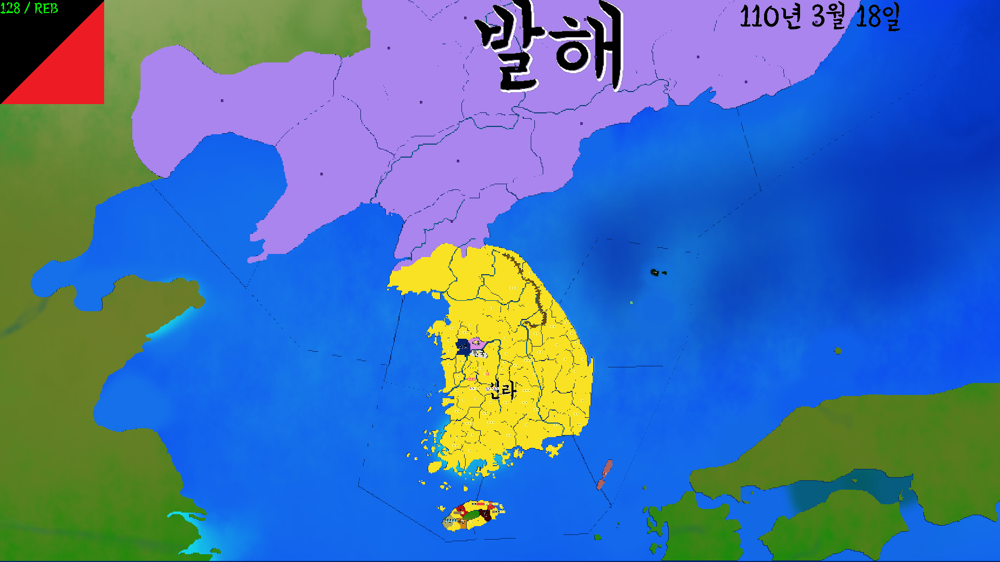

# KoreanHistoryGame-ThreeKings

삼국시대 게임 입니다.
마우스로 조작 가능합니다.

색깔로 땅의 소유 국가를 알 수 있고 아무 국가도 소유하지 않은 땅은
초원으로 표시 됩니다.

## 필요한 라이브러리
SDL 2.0 <https://www.libsdl.org>

SDL_mixer 2.0 <https://www.libsdl.org/projects/SDL_mixer>

SDL_image 2.0 <https://www.libsdl.org/projects/SDL_image>

SDL_ttf 2.0 <https://www.libsdl.org/projects/SDL_ttf>